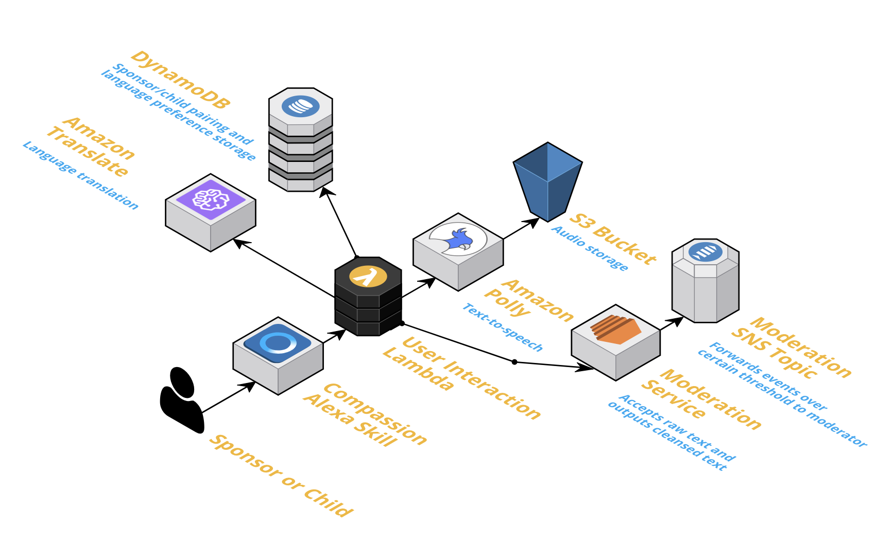

# Compassion Sponsor-to-Child Alexa Skill
## Background
This repository contains code for an Alexa Skill and the associated backend which was created to meet a challenge from Compassion International at the AWS Non-Profit Hackathon for Social Good at re:Invent 2018. Compassion International works to rescue children living in poverty by connecting sponsors in developed countries to these children. 

In addition to the holistic sponsorship of the child's food, clothing,  education, and spirituality, sponsors have historically been encouraged to communicate with the children they sponsor via letters. Compassion has seen that this communication is important in helping to break the poverty cycle to lift the child and future generations out of poverty. Historically, the children are protected by a moderation team that reviews every letter sent between the sponsor and child. People are also employed in translating the languages to and from the relevant languages.

This project builds on Compassion's long-running pen-pal tradition that these sponsors and their children share. The goal is for near-real time communication and translation. While other translation skills/apps exist for near-real time translation, this app has the unique value-add of protecting these children through moderation of the communication. A moderation webservice filters out harmful words and phrases before the message is delivered to the child. If certain thresholds are crossed, communication is ended and the moderation team is notified to review.

## Architecture Diagram


## Deployment Pre-requisites
- Create IAM roles
-- Lambda: requires access to Alexa, Translate, Polly, and DynamoDB
-- EC2: requires access to SNS API
- Setup the AWS CLI
[AWS CLI - Install and Configure](https://docs.aws.amazon.com/cli/latest/userguide/cli-chap-welcome.html)
- Setup the Alexa Skills Kit CLI
[Alexa Skills Kit Quick Start - Steps 1, 2, and 3](https://developer.amazon.com/docs/smapi/quick-start-alexa-skills-kit-command-line-interface.html)

## Deployment Procedure
- Deploy the integration service
```bash
cd interaction-service
ask deploy
```
- Deploy the moderation service
```bash
cd moderation-service
#TODO
```

## Notes for Productionization
- The Lambda-based interaction service should scale relatively well.
- The EC2-based moderation service can be converted to Lambda/API Gateway or adapted for ECS/EKS/Fargate.
- The child/sponsor pairing we have stored in DynamoDB should be pulled from Compassion's existing system.
- A log of all interaction should be stored for administrators to review if necessary.